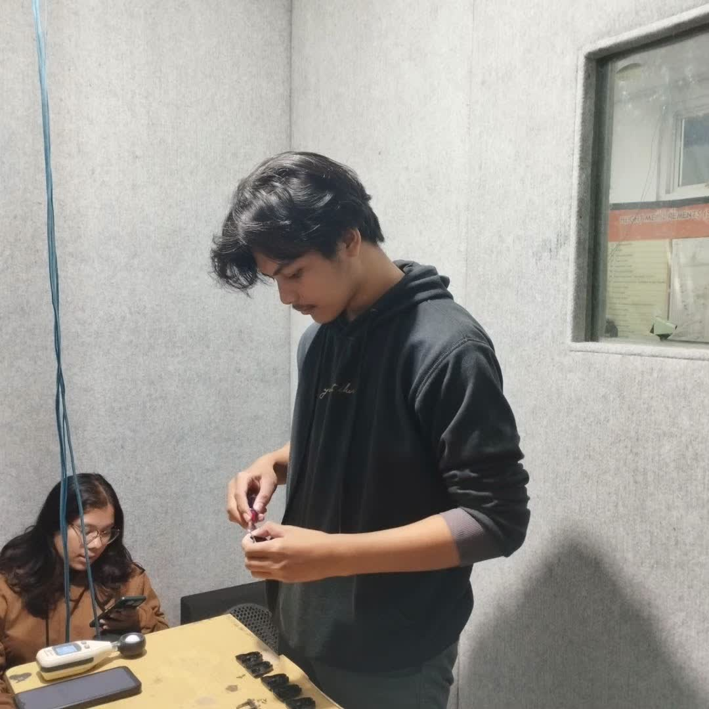
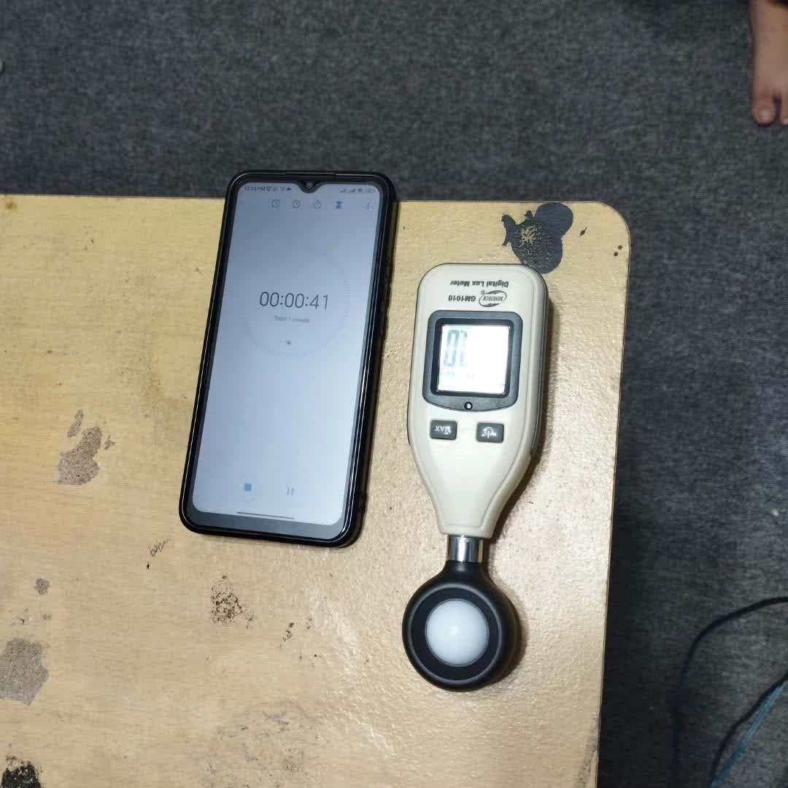
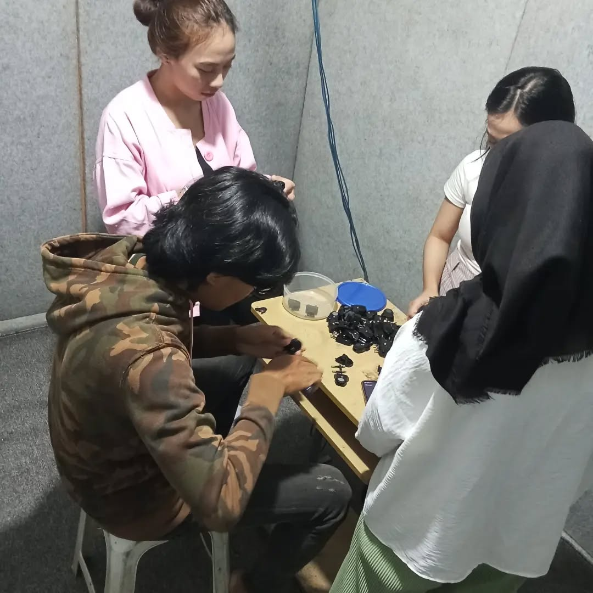
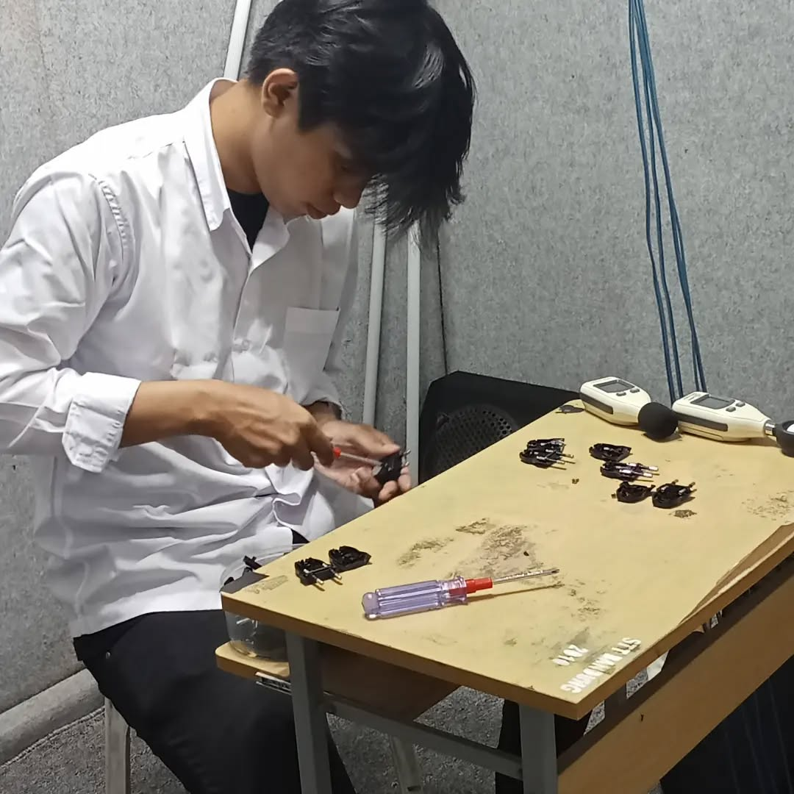
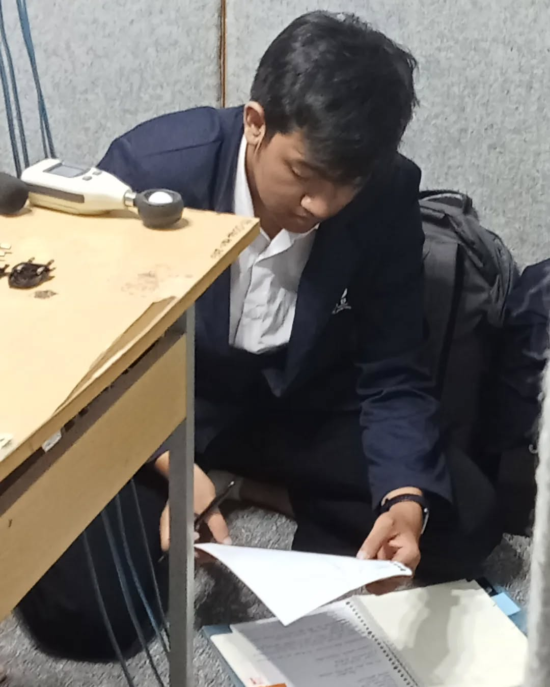
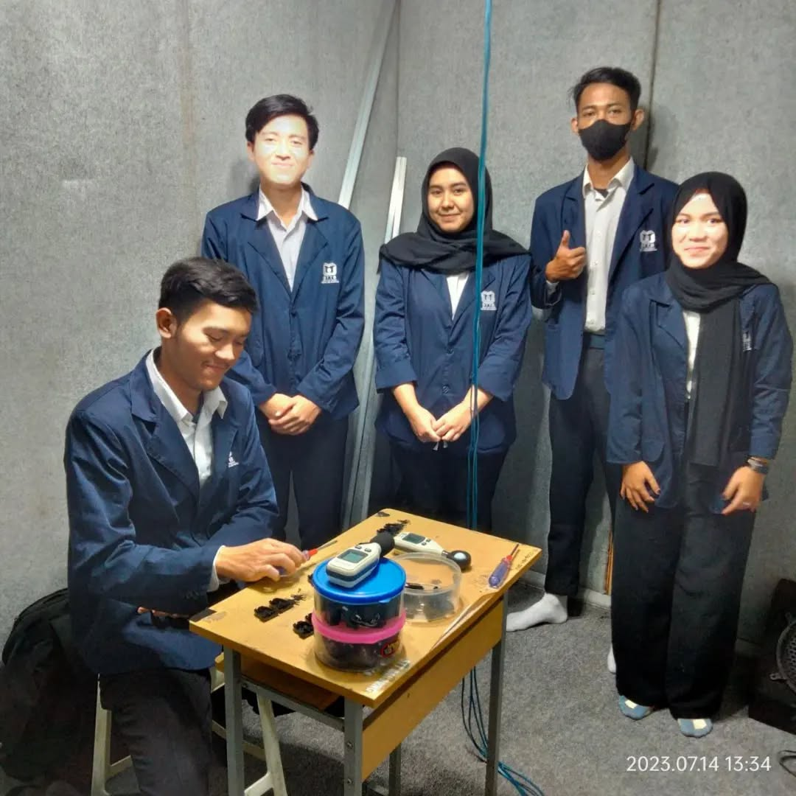
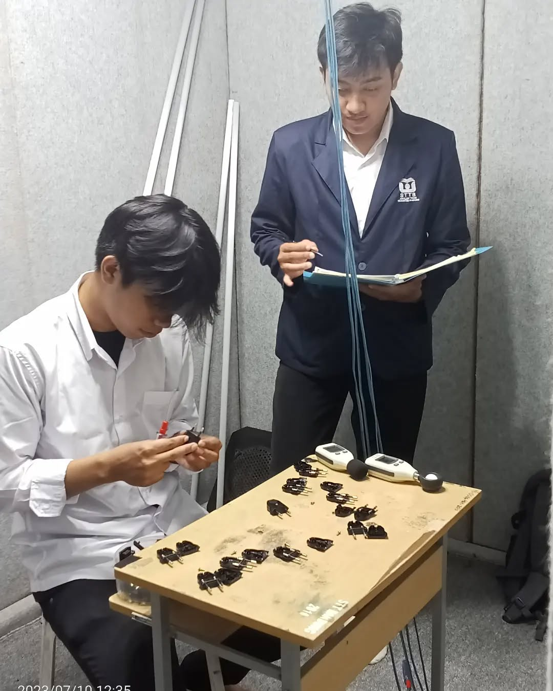

# Umum

- Praktikum mejadi salah satu penunjang pengembangan pengetahuan pelajar
- Sarana dan prasana pembelajaran mempengaruhi kualitas pembelajaran
- Simulasi mempermudah membuat perancangan sistem

# Permasalahan

Studi kasus **Ruang Labolatorium Liklim Universitas Teknologi Bandung**

- Orang yang mencatat / mengambil data dapat mempengaruhi fokus orang yang sedang melakukan simulasi
- Nilai tidak  begitu stabil karena fokus terganggu
- Penacacatan manual rawan hialang dan tidak terstruktur, kerana data akan di kumpulkan dan di analisis

Dokumentsi

# Perancangan Solusi

- Penerapan sistem berbasis IoT, guana memudahkan pengumpulan data.
- Penggunaan Sensor dan Aktuator untuk menunjang Monitoring dan Kendali Ruangan.
- Pembuatan Simulasi Suara agar simulasi lebih nyata.
- Alat berbasis Portable, guna mempermudah penyesuaian dari keinginan pengguna sistem.

# Judul

**Pengoptimalan Sistem Monitoring dan Kendali Ruang Simulasi Industri Berbasis ESP32 dengan Metode Pub-Sub MQTT dan Desain Portabel di Laboratorium Iklim Universitas Teknologi Bandung**

*note: judul lebih menggambarkan alat bukan menggambarkan sistem labolatorium*
