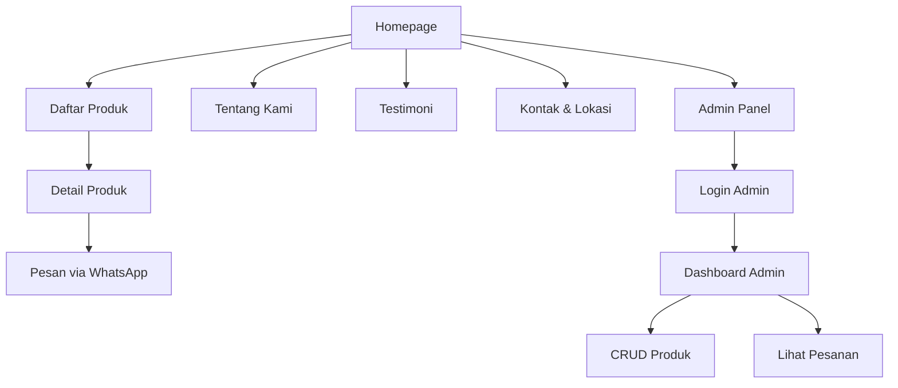

---

## 1. Flowchart Navigasi Utama



---

## 2. Desain Database (Skema ER)

* **User**
  * id (PK)
  * name
  * email
  * password
  * role (enum: customer, admin)
  * timestamps
* **Product**
  * id (PK)
  * name
  * description (text)
  * price (decimal)
  * image_url
  * created_by (FK → User.id)
  * timestamps
* **Testimonial**
  * id (PK)
  * customer_name
  * product_id (FK → Product.id)
  * rating (int 1–5)
  * comment (text)
  * timestamps
* **Order**
  * id (PK)
  * product_id (FK → Product.id)
  * customer_name
  * phone_number
  * quantity (int)
  * total_price (decimal)
  * order_date (datetime)
  * status (enum: pending, confirmed, delivered)
  * timestamps
* **Setting** (opsional untuk jam operasional, alamat, WA)
  * id (PK)
  * key (string)
  * value (text)

---

## 3. Desain Antarmuka (Wireframe)

1. **Homepage**
   * Hero banner + CTA “Pesan Sekarang”
   * Slider produk unggulan
   * Seksi testimoni singkat
2. **Daftar Produk**
   * Grid card (gambar, nama, harga)
   * Pagination
3. **Detail Produk**
   * Gambar besar + galeri
   * Deskripsi, harga, pilihan qty
   * Tombol “Pesan via WhatsApp” (link ke API WA)
4. **Admin Panel**
   * Sidebar (Dashboard, Produk, Pesanan, Pengaturan)
   * Tabel CRUD Produk + tombol Tambah/Edit/Hapus
   * Tabel daftar Pesanan + detail

---

## 4. Tabel Kebutuhan Fungsional

| ID | Fitur                          | Deskripsi                                                                         | Prioritas |
| -- | ------------------------------ | --------------------------------------------------------------------------------- | --------- |
| F1 | Menampilkan daftar produk      | User dapat melihat semua produk dalam bentuk grid dengan filter dan pagination    | Tinggi    |
| F2 | Detail produk                  | User dapat melihat detail lengkap, deskripsi, harga, dan gambar produk            | Tinggi    |
| F3 | Pemesanan via WhatsApp         | Tombol pesan yang mengarahkan ke chat WA dengan template pesan berisi nama produk | Tinggi    |
| F4 | Halaman Tentang Kami           | Menampilkan profil usaha, visi-misi, dan nilai-nilai                              | Sedang    |
| F5 | Halaman Testimoni              | Menampilkan daftar testimoni pelanggan                                            | Sedang    |
| F6 | Halaman Kontak & Lokasi        | Menampilkan alamat, peta (embed Google Maps), nomor WA, dan jam operasional       | Tinggi    |
| F7 | Registrasi & Login Admin       | Admin dapat login untuk mengakses panel backend                                   | Tinggi    |
| F8 | CRUD Produk (Admin)            | Admin dapat menambah, mengedit, menghapus, dan melihat produk                     | Tinggi    |
| F9 | Lihat & Kelola Pesanan (Admin) | Admin dapat melihat detail pesanan dan mengubah status pesanan                    | Tinggi    |

---

## 5. Tabel Kebutuhan Non-Fungsional

| ID  | Kategori         | Deskripsi                                                     | Metode Verifikasi                |
| --- | ---------------- | ------------------------------------------------------------- | -------------------------------- |
| NF1 | Keamanan         | Password tersimpan dengan hashing (bcrypt)                    | Review kode & penetration test   |
| NF2 | Performa         | Halaman produk memuat dalam ≤2 detik                         | Load testing                     |
| NF3 | Skalabilitas     | Struktur MVC Laravel siap untuk modul tambahan                | Code review                      |
| NF4 | Responsif        | UI adaptif untuk desktop, tablet, dan smartphone              | Tes responsif di berbagai device |
| NF5 | Keterbacaan Kode | Mengikuti PSR-12 dan dokumentasi (PHPDoc)                     | Code review                      |
| NF6 | Backup & Restore | Database backup otomatis harian menggunakan scheduler Laravel | Simulasi restore                 |

---

## 6. Teknologi & Struktur Folder

* **Backend** : Laravel 10
* **Frontend** : Blade + Tailwind CSS
* **Database** : MySQL
* **Version Control** : Git + GitHub
* **Editor** : VSCode (PHP Intelephense, Laravel Extension Pack)

```
/app
  /Http
    /Controllers
  /Models
/resources
  /views
    /layouts
    homepage.blade.php
    products/index.blade.php
    products/show.blade.php
    about.blade.php
    testimonials.blade.php
    contact.blade.php
/routes
  web.php
```

---

Dengan rancangan ini, Anda dapat langsung membuat *skeleton* Laravel, mendefinisikan migrasi database, membuat model, controller, dan view sesuai struktur di atas. Semoga membantu!
