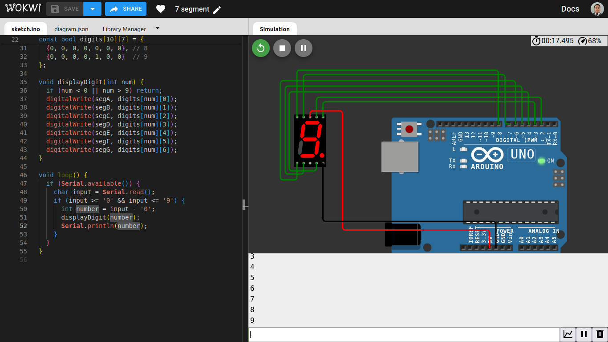

## **Penyusun**

Nama : Syukrillah

NIM : 22552011247

## **Simulasi**



## **Code**

```cpp
const int segA = 2;
const int segB = 3;
const int segC = 4;
const int segD = 5;
const int segE = 6;
const int segF = 7;
const int segG = 8;

void setup() {
  pinMode(segA, OUTPUT);
  pinMode(segB, OUTPUT);
  pinMode(segC, OUTPUT);
  pinMode(segD, OUTPUT);
  pinMode(segE, OUTPUT);
  pinMode(segF, OUTPUT);
  pinMode(segG, OUTPUT);
  
  Serial.begin(9600);
  Serial.println("Masukkan angka 0-9:");
}

const bool digits[10][7] = {
  {0, 0, 0, 0, 0, 0, 1}, // 0
  {1, 0, 0, 1, 1, 1, 1}, // 1
  {0, 0, 1, 0, 0, 1, 0}, // 2
  {0, 0, 0, 0, 1, 1, 0}, // 3
  {1, 0, 0, 1, 1, 0, 0}, // 4
  {0, 1, 0, 0, 1, 0, 0}, // 5
  {0, 1, 0, 0, 0, 0, 0}, // 6
  {0, 0, 0, 1, 1, 1, 1}, // 7
  {0, 0, 0, 0, 0, 0, 0}, // 8
  {0, 0, 0, 0, 1, 0, 0}  // 9
};

void displayDigit(int num) {
  if (num < 0 || num > 9) return;
  digitalWrite(segA, digits[num][0]);
  digitalWrite(segB, digits[num][1]);
  digitalWrite(segC, digits[num][2]);
  digitalWrite(segD, digits[num][3]);
  digitalWrite(segE, digits[num][4]);
  digitalWrite(segF, digits[num][5]);
  digitalWrite(segG, digits[num][6]);
}

void loop() {
  if (Serial.available()) {
    char input = Serial.read();
    if (input >= '0' && input <= '9') {
      int number = input - '0';
      displayDigit(number);
      Serial.println(number);
    }
  }
}

```

## **Konsep**

#### 1. **7-Segment Display**

Komponen ini terdiri dari 7 LED yang membentuk angka. Setiap segmen dinamai sebagai:

* `A` sampai `G`

Penamaannya seperti ini:

```
   A
  ---
F|   |B
 | G |
  ---
E|   |C
 |   |
  ---
   D
```

Jadi, untuk membentuk angka 0–9, kita menyalakan kombinasi segmen tertentu.

---

#### 2. **Deklarasi Pin (Lines 1–7)**

```cpp
const int segA = 2;
const int segB = 3;
...
const int segG = 8;
```

Pin-pin ini terhubung ke masing-masing segmen dari 7-segment display.

---

#### 3. **Inisialisasi `pinMode` (di `setup()`)**

```cpp
pinMode(segA, OUTPUT);
...
```

Semua pin diset sebagai OUTPUT karena kita akan **mengirim sinyal** untuk menghidupkan/mematikan segmen.

---

#### 4. **Tabel Digit ke Segmen (Array `digits`)**

```cpp
const bool digits[10][7] = {
  {0, 0, 0, 0, 0, 0, 1}, // 0
  ...
};
```

Array ini menunjukkan **kombinasi segmen** yang harus **dihidupkan (0)** atau **dimatikan (1)** untuk menampilkan setiap angka.

> Kenapa 0 berarti nyala? Karena ini kemungkinan pakai  **common anode** : LOW (0) = nyala, HIGH (1) = mati.

Contoh:

* Angka 0 → Semua segmen nyala kecuali G (segG = 1 → mati)
* Angka 1 → Hanya B dan C nyala (yang lainnya mati)

---

#### 5. **Fungsi `displayDigit(int num)`**

Fungsi ini membaca array `digits[num]` dan menyalakan/mematikan segmen sesuai data.

---

#### 6. **Input dari Serial Monitor**

```cpp
if (Serial.available()) {
  char input = Serial.read();
```

Jika ada input dari user (angka 0–9), Arduino akan membacanya, mengubah dari karakter ke angka, lalu menampilkan di 7-segment.

---

## Contoh Penggunaan

1. Buka **Serial Monitor**
2. Ketik angka `5`, tekan enter
3. Arduino akan memanggil `displayDigit(5)`
4. Segmen tertentu menyala, membentuk angka 5
